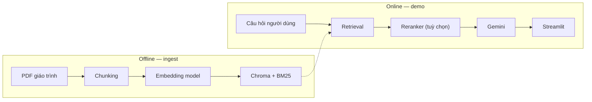

# UniPolis

[](https://www.python.org/)
[](https://streamlit.io/)
[](docs/DAC_TA_DO_AN_CS431.md)
[](https://www.sbert.net/)

**Hệ thống RAG hỗ trợ học tập giáo trình lý luận chính trị tiếng Việt** — hỏi đáp có trích dẫn nguồn, tạo đề thi, fine-tune bi-encoder với hard negative mining, và đánh giá retrieval + downstream RAGAS.

[Tổng quan](#tổng-quan) • [Tính năng](#tính-năng) • [Kiến trúc](#kiến-trúc) • [Cấu trúc repo](#cấu-trúc-repo) • [Bắt đầu](#bắt-đầu) • [Đánh giá](#đánh-giá) • [Notebook](#notebook) • [FAQ](#faq)

---

## Tổng quan

UniPolis là đồ án môn **CS431 — Các kỹ thuật học sâu và ứng dụng**. Hệ thống kết hợp:

- **Retrieval-Augmented Generation (RAG)** trên 6 giáo trình lý luận chính trị
- **Fine-tune Vietnamese Bi-Encoder V2** với hard negative mining trên dữ liệu QA tự sinh
- **Đánh giá hai tầng**: retrieval (MRR, Recall@k) và downstream (RAGAS + Answer Relevancy)
- **Demo Streamlit** với nhiều chế độ pipeline (BM25 nhanh → Dense MMR + reranker chất lượng cao)

> [!NOTE]
> Repo này là **bản nộp CS431** — gồm source code, notebook, dữ liệu huấn luyện, kết quả thí nghiệm và tài liệu báo cáo. Trọng lượng model (~517 MB) và vector store Chroma được tải/build riêng (xem [models/README.md](models/README.md)).

### Đóng góp học sâu chính

| Thành phần | Mô tả |
|------------|-------|
| Bi-Encoder V2 | Fine-tune `bkai-foundation-models/vietnamese-bi-encoder` với MNRL + mined hard negatives |
| Split dữ liệu | Train/val/test theo `(môn, chapter)` — tránh leakage giữa các split |
| So sánh embedding | Base VN Bi-Encoder, BGE-M3, E5-Large, V2 trên test set 611 queries |
| RAGAS eval | Base vs V2 trên 30 câu PLDC — Faithfulness, Context Precision/Recall |

---

## Tính năng

- **Hỏi đáp theo môn** — 6 giáo trình, mỗi môn có vector store riêng
- **4 pipeline mode** — Fast / Balance (BM25), Quality (BGE-M3 + reranker), Quality · VN Bi-Encoder FT
- **Trích dẫn nguồn** — hiển thị chunk/trang để người học kiểm chứng
- **Tạo đề thi** — sinh câu hỏi từ ngữ cảnh đã truy hồi
- **Notebook tái lập** — fine-tune, benchmark retrieval, RAGAS end-to-end trên Kaggle

---

## Kiến trúc

### Luồng demo (Streamlit)

```text
PDF giáo trình
  → PyMuPDF + làm sạch
  → Chunking (sentence-aware hoặc recursive 512/64)
  → Embedding (BGE-M3 / Vietnamese Bi-Encoder FT)
  → ChromaDB (dense) + BM25 (sparse)
  → Retrieval: BM25 | Dense MMR | (+ CrossEncoder rerank)
  → Gemini sinh câu trả lời
  → UI: câu trả lời + nguồn tham chiếu
```



### Luồng fine-tune & đánh giá

```text
PDF → data_generation.ipynb → qa_audit.jsonl
  → data_filter.ipynb (lọc chất lượng)
  → fine-tuning-vietnamese-bi-encoder-v2.ipynb (base → V1 → V2)
  → compare_biencoder_v2_retrieval.py (MRR / Recall@k)
  → run_ragas_retriever_comparison.py (RAGAS downstream)
```

> [!IMPORTANT]
> **Chunking phải nhất quán** giữa sinh dữ liệu fine-tune, benchmark và ingest demo. Dữ liệu QA được sinh bằng chunk theo câu (~735 ký tự); ingest demo FT dùng `recursive 512/64`. Chi tiết xem [docs/huong-dan-fine-tuning-bi-encoder-rag.md](docs/huong-dan-fine-tuning-bi-encoder-rag.md).

---

## Cấu trúc repo

```text
cs431/
├── app.py                          # Demo Streamlit
├── rag_engine.py                   # RAG: retrieval, rerank, generation
├── config.py                       # Môn học, pipeline modes
├── ingest.py                       # Ingest đơn môn (sentence-aware)
├── ingest_political_6_recursive_bge.py  # Ingest 6 môn (recursive + profile vn-bi-ft)
├── exam_generator.py / exam_tab.py # Tạo đề thi
├── scripts/                        # Benchmark & RAGAS
├── Notebook/                       # Fine-tune, eval, data pipeline
├── data/
│   ├── *.pdf                       # 6 giáo trình
│   └── training_data/              # qa_audit.jsonl (3 môn)
├── models/                         # Metadata model (weights tải riêng)
├── artifacts/                      # Kết quả MRR, RAGAS
└── docs/                           # Đặc tả, báo cáo, hướng dẫn
```

---

## Bắt đầu

### Yêu cầu

- Python 3.10+
- `GOOGLE_API_KEY` — sinh câu trả lời qua Gemini ([lấy API key](https://aistudio.google.com/apikey))
- ~2 GB RAM cho demo BM25; GPU khuyến nghị khi dùng embedding local + reranker
- Model V2 và Chroma — xem bước 2–3 bên dưới

### 1. Cài đặt

```bash
git clone <repo-url>
cd cs431

python -m venv .venv
source .venv/bin/activate   # Windows: .venv\Scripts\activate

pip install -r requirements.txt
cp .env.example .env        # điền GOOGLE_API_KEY
```

### 2. Tải model fine-tune

Model **Vietnamese Bi-Encoder V2** (~517 MB) không có trong Git.

```bash
# Tải từ Kaggle dataset dangvy1507/models, giải nén vào:
mkdir -p models/bi_encoder_hnm_v2
# → models/bi_encoder_hnm_v2/vietnamese-bi-encoder-v2-hnm/
```

Chi tiết: [models/README.md](models/README.md)

### 3. Build vector store

**Chế độ mặc định (BGE-M3 + BM25):**

```bash
python ingest_political_6_recursive_bge.py --profile bge
```

**Chế độ fine-tune (VN Bi-Encoder V2):**

```bash
python ingest_political_6_recursive_bge.py \
  --profile vn-bi-ft \
  --model models/bi_encoder_hnm_v2/vietnamese-bi-encoder-v2-hnm \
  --force-rebuild
```

> [!TIP]
> Chỉ ingest môn cần demo để tiết kiệm thời gian:
> `python ingest_political_6_recursive_bge.py --subjects "Pháp luật đại cương" --profile vn-bi-ft --model models/bi_encoder_hnm_v2/vietnamese-bi-encoder-v2-hnm`

### 4. Chạy demo

```bash
streamlit run app.py
```

Mở `http://localhost:8501`, chọn môn học và pipeline mode:

| Mode | Retrieval | Embedding |
|------|-----------|-----------|
| Fast / Balance | BM25 | BGE-M3 index |
| Quality | Dense MMR + reranker | BGE-M3 |
| **Quality · VN Bi-Encoder (FT)** | Dense MMR + reranker | **Model V2 fine-tune** |

---

## Đánh giá

### Retrieval — test set 611 queries (3 môn)

Nguồn: `artifacts/compare_biencoder_v2_retrieval.csv`

| Model | MRR@10 | Recall@5 | Recall@10 |
|-------|--------|----------|-----------|
| Base VN Bi-Encoder | 0.760 | 0.905 | 0.949 |
| BGE-M3 | 0.873 | 0.967 | 0.990 |
| E5-Large | 0.866 | 0.957 | 0.987 |
| **V2 hard negative** | **0.844** | **0.953** | **0.974** |

V2 cải thiện **+8.4% MRR@10** so với base VN Bi-Encoder trên cùng test split.

### Fine-tune — MRR@10 trên val/test (notebook V2)

Nguồn: `models/bi_encoder_hnm_v2/artifacts/bi_encoder_hnm_eval_summary.json`

| Model | Val MRR@10 | Test MRR@10 |
|-------|------------|-------------|
| Base | 0.423 | 0.418 |
| V1 (MNRL) | 0.466 | 0.479 |
| **V2 (HNM)** | **0.486** | **0.498** |

### Downstream RAGAS — 30 câu PLDC

Nguồn: `artifacts/ragas_retriever_comparison_pldc_30_retry/ragas_summary_full.csv`

| Model | Faithfulness | Answer Relevancy | Context Precision | Context Recall |
|-------|--------------|------------------|-------------------|----------------|
| Base | 0.960 | 0.950* | 0.784 | 0.902 |
| **V2** | 0.944 | **0.983*** | **0.826** | **0.993** |

\*Answer Relevancy chấm thủ công (`answer_relevancy_source=manual`) do giới hạn tương thích Gemini + RAGAS.

### Chạy lại benchmark

```bash
# Retrieval
python scripts/compare_biencoder_v2_retrieval.py \
  --training-base data/training_data

# RAGAS (cần GOOGLE_API_KEY)
python scripts/run_ragas_retriever_comparison.py \
  --training-base data/training_data \
  --source training_data_pldc \
  --sample-size 30
```

---

## Notebook

| Notebook | Vai trò |
|----------|---------|
| [`fine-tuning-vietnamese-bi-encoder-v2.ipynb`](Notebook/fine-tuning-vietnamese-bi-encoder-v2.ipynb) | **Notebook chính** — train V1/V2, hard negative mining, eval |
| [`data_generation.ipynb`](Notebook/data_generation.ipynb) | Sinh QA pairs từ PDF |
| [`data_filter.ipynb`](Notebook/data_filter.ipynb) | Lọc QA kém chất lượng |
| [`compare.ipynb`](Notebook/compare.ipynb) | So sánh embedding đa môn |
| [`ragas-kaggle-local.ipynb`](Notebook/ragas-kaggle-local.ipynb) | RAGAS E2E với Qwen trên Kaggle |
| [`fine-tuning-bge-m3-v2.ipynb`](Notebook/fine-tuning-bge-m3-v2.ipynb) | Baseline BGE-M3 (tham khảo) |

> [!TIP]
> Notebook fine-tune chạy trên **Kaggle GPU** với dataset `dangvy1507/training-data`. Bật Internet khi cài `sentence-transformers`.

---

## Tài liệu báo cáo

| File | Nội dung |
|------|----------|
| [docs/DAC_TA_DO_AN_CS431.md](docs/DAC_TA_DO_AN_CS431.md) | Đặc tả đồ án |
| [docs/BAO_CAO_UNIPOLIS_NOI_DUNG_HOC_THUAT.md](docs/BAO_CAO_UNIPOLIS_NOI_DUNG_HOC_THUAT.md) | Nội dung học thuật |
| [docs/BAO_CAO_DO_AN_UNIPOLIS_FULL.md](docs/BAO_CAO_DO_AN_UNIPOLIS_FULL.md) | Báo cáo đầy đủ |
| [docs/huong-dan-fine-tuning-bi-encoder-rag.md](docs/huong-dan-fine-tuning-bi-encoder-rag.md) | Hướng dẫn fine-tune & RAG |

---

## FAQ

**Tại sao không có model weights trong repo?**  
File `model.safetensors` ~517 MB vượt giới hạn GitHub hợp lý. Tải từ Kaggle và đặt theo [models/README.md](models/README.md).

**Tại sao không có thư mục `data/chroma_db_*`?**  
Vector store phụ thuộc embedding model và máy local. Build bằng `ingest_political_6_recursive_bge.py` sau khi có PDF + model.

**Demo báo thiếu BM25 index?**  
Chạy ingest cho đúng môn và đúng `--profile` (bge hoặc vn-bi-ft) trước khi mở Streamlit.

**Pipeline RAGAS script khác demo Streamlit?**  
Script RAGAS dùng **dense cosine top-k** (không BM25/hybrid). Demo dùng BM25 hoặc Dense MMR + reranker. So sánh công bằng khi cùng embedding và cùng corpus chunk.

**Làm sao đặt VN Bi-Encoder FT làm mặc định?**  
Trong `app.py`, đổi `index` của `st.selectbox` pipeline mode sang mode `🎯 Quality · VN Bi-Encoder (FT)`.

---

## Tài nguyên bên ngoài

- [Vietnamese Bi-Encoder (BKAI)](https://huggingface.co/bkai-foundation-models/vietnamese-bi-encoder)
- [BGE-M3](https://huggingface.co/BAAI/bge-m3) · [BGE Reranker v2-m3](https://huggingface.co/BAAI/bge-reranker-v2-m3)
- [RAGAS](https://docs.ragas.io/) · [Sentence Transformers](https://www.sbert.net/)
- Kaggle datasets: `dangvy1507/training-data`, `dangvy1507/models`

---

*Đồ án CS431 — UniPolis: RAG cho giáo trình lý luận chính trị tiếng Việt.*
